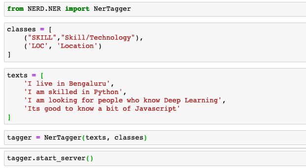
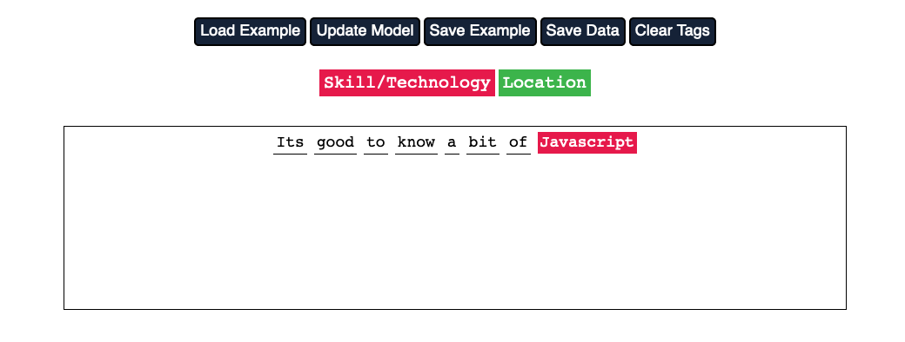

# NERD

In the realm of text data, two problems are more common than others.
 - Text Classification
 - Named Entity Recognition
 
 The number of use cases that these technique have is quite astonishing. 
 Text classification itself has many different variants. News Classification, Span classification, etc are the common usecases.
 However we come across uncommon usecases every now and then. For example, whether a given piece of text is an address or not.
 
 Similarly Named Entity Recognition is another very common use case. There are great open-source packages for standard entities like Companies, Location, Person Name.
 However, we come across cases where we deal with uncommon entity types. For Example, whether a text contains skill/technology mentioned.
 
 The problem escalates vastly because more often than not we don't have the training data present already. Instead we ourselves have to prepare the data from scratch which is the most of our troubles.
 
 ### NERD is a solution.
 
 NERD provide modules for TextClassification and NER Tagging.
 Using NERD is simple. Collect all the raw text into a list of strings along with unique class types and pass it to the modules and start server.
 
 
 
 
 The server starts at default port 5050 and opens up the following UI
 
 
 
 Annotation is very simple. Just select the text and click on the entity type it belongs to.
 Then save the example and load next example. 
 
 
 The UI also provides a Update Model button. After the first model update, examples are pretagged by the model before they are loaded in the UI.
 This has 2 benefits:-
 - It usually decrease your effort on tagging.
 - The example are chosen by an active learning strategy. So the example loaded is difficult for the model to tag and thus tagging this particular example gives much information to the model.
 
 
 Once you are done tagging a few examples you can go back to the notebook environment and terminate the server.
 The NerTagger class provides several methods for you to access tagged data and export the model.
 
 
 
 #### A very similar approach is followed in Text classification as well.
 The examples are chosen with an active learning strategy so that you tag the most difficult examples.